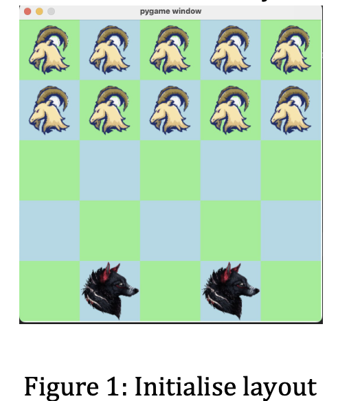
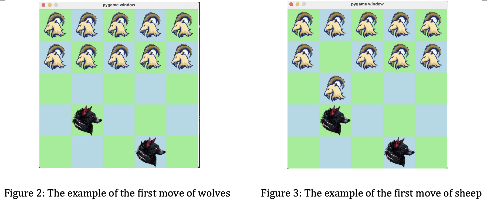
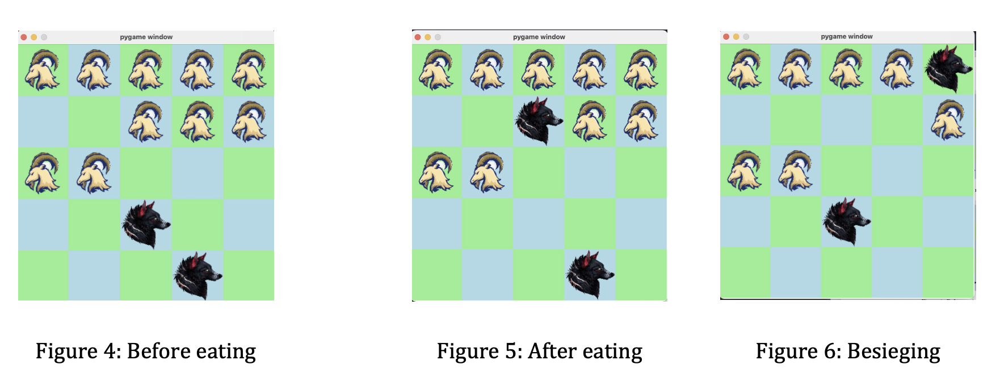
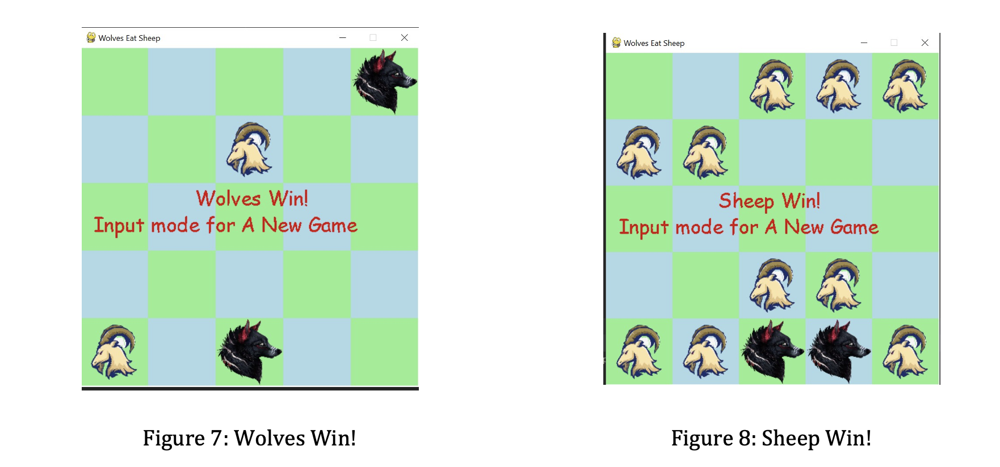
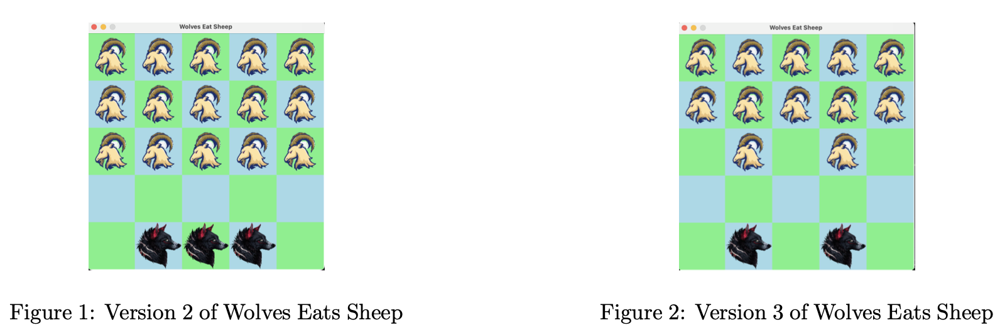
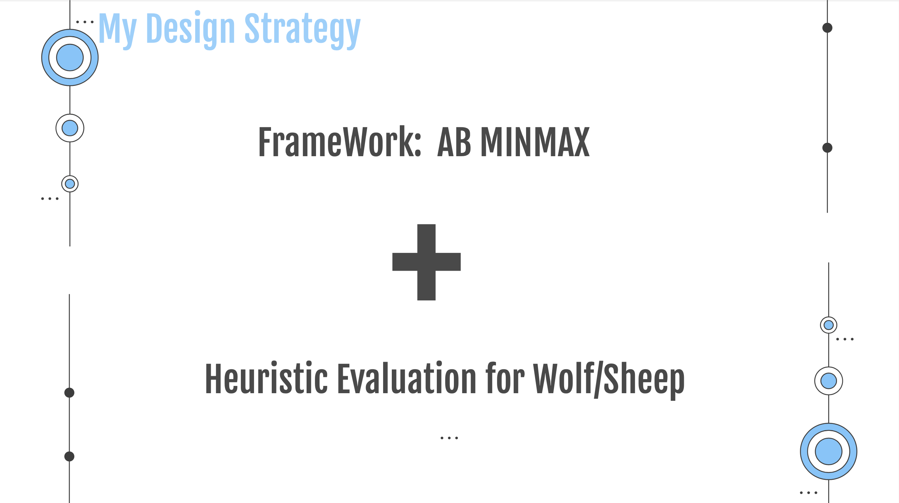
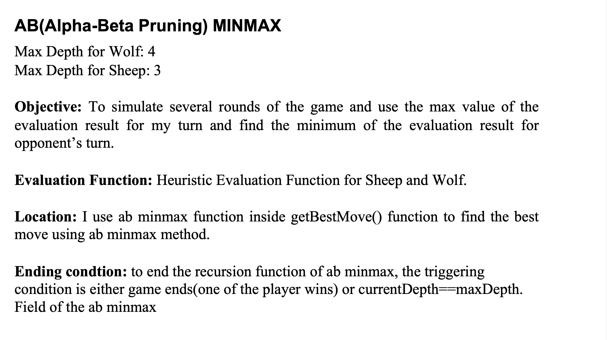
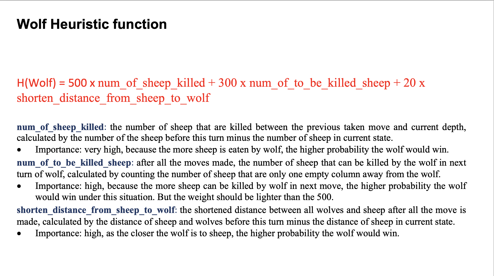
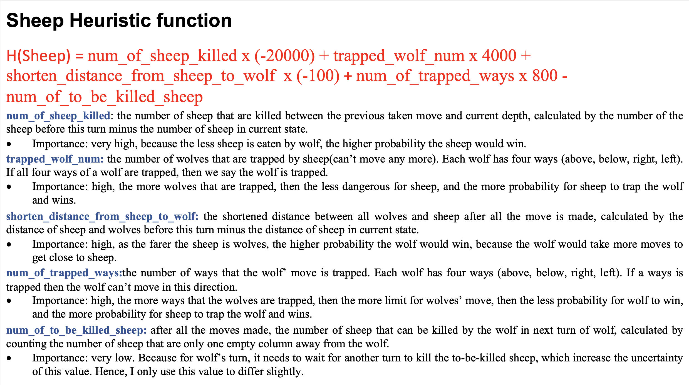

<div align="center">
  
</div>
 
# **CS4386 Assignment 1 (Semester B, 2022-2023)**

# **Name: LUO Peiyuan SID: 56642728**

# Table of Contents
**0. Game Description**

***0.1 Chessboard***

***0.2 Rules***

***0.3 How to Win?***

**1. Utility Functions**

***1.1 Board Class***

***1.2 makeMove function*** 

***1.3 check\_total\_distance\_from\_sheep\_to\_wolf***

***1.4 calculate\_shortened\_distance\_by\_current\_move***

***1.5 check\_num\_of\_ways\_wolf\_trapped\_and\_num\_of\_wolf\_trapped***

***1.6 check\_num\_of\_sheep\_and\_num\_of\_to\_be\_killed***

***1.7 calculate\_sheep\_scores***

***1.8 calculate\_wolf\_scores***

***1.9 check\_wolf\_trapped\_in\_this\_way***

***1.10 getWolfMoves***

***1.11 getSheepMoves***

***1.12 game\_ends function***

**2. Methodology**

***2.1 AB\_Minmax***

****2.1.1 Objective****

****2.1.2 Implementation****

***2.2 Heuristic Evaluation***

****2.2.1Wolf Heuristic Function****

****2.2.2 Sheep Heuristic Function****

**3. Game Theory Exploration**

***3.1 Q1: Is this a fair game?***

***3.2 Q2: Can the designed AI algorithm work if we change the number of pieces (as shown in figure 1, 2)?***

**4. Presentation Slides**

**5. APPENDIX**

# 0. GAME DESCRIPTION

Wolves Eats Sheep is a folk board game from China, each player can only choose one role (one wolf or one sheep) to play in one round.

## 0.1 Chessboard

The chessboard has totally 5 ∗ 5 = 25 squares.

And it is divided into two parties: Sheep side: There are ten chess pieces called sheep. Wolf side: There are two chess pieces called wolves. The initial chessboard layout is shown in the figure 1 below:


<div align="center">
  
</div>

## 0.2 Rules

**Order:** Wolves first, sheep second, then the game obeys this order iteratively until one of them wins. In a round, Wolves must choose a valid step or an eating step, and the sheep must choose a valid step.

**A valid step:** Both wolves or sheep can take one step on their turn to an empty square (from the current position to a nearby position. **Only front, back, left, and right are legal directions, others are illegal. Also, please notice the chess bound.**). Here are two examples (figure 2, 3):

**Eating:** Wolves can eat sheep when they are separated by only **one empty square** and in a

straight line (**Only front, back, left, and right are legal directions, others are illegal**). (e.g. figure 4,5). After eating, the eaten sheep will not appear on the board.

**Besieging:** In the same time, sheep can besiege wolves, which means wolves cannot find a legal step in their turn. For example, the wolf on the right top (Figure 6) is trapped by sheep (In this situation, the trapped wolf cannot move because there is no empty square for this wolf to walk.).

## 0.3 How to win?

**For Wolves:** All sheep are eaten or the resting sheep cannot trap them in finite steps (less or equal to **two**, figure 7 show the winning of wolves).

**For sheep:** All wolves are trapped and cannot move. (as shown in figure 8)


<div align="center">
  
</div>
<div align="center">
  
</div>
<div align="center">
  
</div>


# **1. Utility Functions**

## **1.1 Board Class**

This class stores some utility function related to the game board checking as follows. And each board object stores the current player of the board, state matrix, and winner of this board(if applicable).

```python
class Board:
    def __init__(self, player, state):

    def update_winner(self, winner):

    def makeMove(self, move):

    def currentPlayer(self):

    def check_total_distance_from_sheep_to_wolf(self):

    def check_num_of_ways_wolf_trapped_and_num_of_wolf_trapped(self):

    def check_num_of_sheep_and_num_of_to_be_killed(self):
        
    @staticmethod
    def calculate_shortened_distance_by_current_move(org_board, cur_board):
        
    def calculate_sheep_scores(self, num_of_sheep_killed, shortened_distance, num_of_trapped_ways, trapped_wolf_num,num_of_to_be_killed_sheep):
        def calculate_trapped_scores(num):
            
    def calculate_wolf_scores(self,num_of_sheep_killed, shorten_distance_from_sheep_to_wolf, num_of_trapped_ways, org_board,num_of_to_be_killed_sheep):
        
    def check_wolf_trapped_in_this_way(self, i, j):
        
    def game_ends(self):
        
    def getWolfMoves(self):
        
    def getSheepMoves(self):
       
    def evaluate(self, player, gameEnds, org_board):
```

### **1.2 makeMove function**

This method would take the move as input, change the game state, update the next player and return a new board object.
```python
def makeMove(self, move):
    '''
    This method would take the move as input, change the game state, update the next player and return a new board object.
    '''
    [start_row, start_col, end_row, end_col] = move
    matrix2 = copy.deepcopy(self.state)
    matrix2[end_row, end_col] = self.player
    matrix2[start_row, start_col] = 0
    nextPlayer = 2 if self.player == 1 else 2
    return Board(nextPlayer, matrix2)
```


### **1.3 check\_total\_distance\_from\_sheep\_to\_wolf**

Return the total distance from sheep to wolf of current state.

**Objective:**  for the later heuristic evaluation function

```python
def check_total_distance_from_sheep_to_wolf(self):
    '''
    Return the total distance from sheep to wolf of current state.
    '''
    wolf1_location = self.wolf1_location
    wolf2_location = self.wolf2_location
    total_distance = 0
    board = self.state
    for i in range(5):
        for j in range(5):
            if board[i][j] == 1:
                dist_current_to_wolf1 = abs(i - wolf1_location[0]) + abs(j - wolf1_location[1])
                dist_current_to_wolf2 = abs(i - wolf2_location[0]) + abs(j - wolf2_location[1])
                total_distance += (dist_current_to_wolf1 + dist_current_to_wolf2)
    return total_distance
```
### **1.4 calculate\_shortened\_distance\_by\_current\_move**

Return the difference of the total distance of all wolves and sheep between the original board and current board. If the returned value is positive, then the distance between wolf and sheep are shortened. Otherwise, the distance increased.

**Objective:**  for the later heuristic evaluation function

```python
def calculate_shortened_distance_by_current_move(org_board, cur_board):
    '''
    Return the difference of the total distance of all wolves and sheep between the original board and current board. If the returned value is positive, then the distance between wolf and sheep are shortened. Otherwise, the distance increased.
    Objective:  for the later heuristic evaluation function
    '''
    return org_board.check_total_distance_from_sheep_to_wolf()-cur_board.check_total_distance_from_sheep_to_wolf()
```

### **1.5 check\_num\_of\_ways\_wolf\_trapped\_and\_num\_of\_wolf\_trapped**

**Implemntation:** check the current state, and output the number of ways that wolf’s next move are trapped (max 4 for each wolf) and number of wolf that is already trapped(max 2).

***trapped:** the wolf can’t move in this direction

**Objective:**  for the later heuristic evaluation function

```python
def check_num_of_ways_wolf_trapped_and_num_of_wolf_trapped(self):
    '''
    Implemntation: check the current state, and output the number of ways that wolf’s next move are trapped (max 4 for each wolf) and number of wolf that is already trapped(max 2).
     *trapped: the wolf can’t move in this direction
    Objective:  for the later heuristic evaluation function
    '''

    wolf_locations = [self.wolf1_location, self.wolf2_location]
    num_of_trapped = 0
    trapped_wolf_num = 0
    for wolf_loc in wolf_locations:
        wolf_loc_x = wolf_loc[0]
        wolf_loc_y = wolf_loc[1]
        trapped_ways = [[wolf_loc_x - 1, wolf_loc_y], [wolf_loc_x, wolf_loc_y - 1], [wolf_loc_x, wolf_loc_y + 1],
                        [wolf_loc_x + 1, wolf_loc_y]]
        trapped = False
        for way in trapped_ways:
            if self.check_wolf_trapped_in_this_way(way[0], way[1]):
                num_of_trapped += 1
        if num_of_trapped == 4:
            trapped_wolf_num += 1
            num_of_trapped -= 4
    return num_of_trapped, trapped_wolf_num
```
### **1.6 check\_num\_of\_sheep\_and\_num\_of\_to\_be\_killed**

return the number of sheep at this state and the number of sheep that can be killed at next step(one empty column away from wolf).

**Objective:**  for the later heuristic evaluation function

```python
def check_num_of_sheep_and_num_of_to_be_killed(self):
    '''
    return  the number of sheep at this state and the number of sheep that can be killed at next step(one empty column away from wolf).

    Objective:  for the later heuristic evaluation function

    '''
    sheep_cnt = 0
    num_of_to_be_killed_sheep = 0
    board = self.state
    for i in range(5):
        for j in range(5):
            tmp_num = 0
            if board[i][j] == 1:
                sheep_cnt += 1
                if i + 2 < 5:
                    if board[i + 2, j] == 1 and board[i + 1, j] == 0:
                        tmp_num += 1
                if i - 2 >= 0:
                    if board[i - 2, j] == 1 and board[i - 1, j] == 0:
                        tmp_num += 1
                if j + 2 < 5:
                    if board[i, j + 2] == 1 and board[i, j + 1] == 0:
                        tmp_num += 1
                if j - 2 >= 0:
                    if board[i, j - 2] == 1 and board[i, j - 1] == 0:
                        tmp_num += 1
                num_of_to_be_killed_sheep += tmp_num if tmp_num <= 1 else 1
    return sheep_cnt, num_of_to_be_killed_sheep
```

### **1.7 calculate\_sheep\_scores**

calculate the heuristic value of the sheep when the board is not yet end but reach the max depth.

**Objective:**  for the later heuristic evaluation function

```python
def calculate_sheep_scores(self, num_of_sheep_killed, shortened_distance, num_of_trapped_ways, trapped_wolf_num,num_of_to_be_killed_sheep):
    '''
    calculate the heuristic value of the sheep when the board is not yet end but reach the max depth.

    Objective:  for the later heuristic evaluation function
    '''
    def calculate_trapped_scores(num):
        # res = 0
        # for i in range(num + 1):
        #     res += 2 * i ** 2
        return num
    return num_of_sheep_killed * (-20000) + shortened_distance * (-100) + calculate_trapped_scores(num_of_trapped_ways)*800 + trapped_wolf_num * 4000  - num_of_to_be_killed_sheep
```
### **1.8 calculate\_wolf\_scores**

calculate the heuristic value of the wolf when the board is not yet end but reach the max depth.

**Objective:**  for the later heuristic evaluation function

```python
def calculate_wolf_scores(self,num_of_sheep_killed, shorten_distance_from_sheep_to_wolf, num_of_trapped_ways, org_board,num_of_to_be_killed_sheep):
    '''
    calculate the heuristic value of the wolf when the board is not yet end but reach the max depth.
    Objective:  for the later heuristic evaluation function
    '''
    def calculate_trapped_scores(num):
        res = 0
        for i in range(num + 1):
            res += 4 * i ** 2
        return res
    # shorten_distance_from_sheep_to_wolf = shorten_distance_from_sheep_to_wolf if shorten_distance_from_sheep_to_wolf == 0 else 1
    return num_of_sheep_killed * 500 + shorten_distance_from_sheep_to_wolf*20 - 0 * calculate_trapped_scores(num_of_trapped_ways) + 300 * num_of_to_be_killed_sheep

```
### **1.9 check\_wolf\_trapped\_in\_this\_way**

check whether wolf is trapped in this way.

Objective: used in check\_num\_of\_ways\_wolf\_trapped\_and\_num\_of\_wolf\_trapped function.

```python
def check_wolf_trapped_in_this_way(self, i, j):
    '''
    check whether wolf is trapped in this way.

    Objective: used in check_num_of_ways_wolf_trapped_and_num_of_wolf_trapped function.
    '''
    board = self.state
    if i < 0 or i > 4 or j < 0 or j > 4:
        return True
    if board[i][j] != 0:
        return True
    return False
```
### **1.10 getWolfMoves**

Return the valid moves for wolves.
```python
def getWolfMoves(self):
    matrix = self.state
    candidates = []
    for i in range(5):
        for j in range(5):
            if matrix[i, j] == 2:
                if i + 1 < 5:
                    if matrix[i + 1, j] == 0:
                        candidates.append([i, j, i + 1, j])
                if i - 1 >= 0:
                    if matrix[i - 1, j] == 0:
                        candidates.append([i, j, i - 1, j])
                if j + 1 < 5:
                    if matrix[i, j + 1] == 0:
                        candidates.append([i, j, i, j + 1])
                if j - 1 >= 0:
                    if matrix[i, j - 1] == 0:
                        candidates.append([i, j, i, j - 1])
                if i + 2 < 5:
                    if matrix[i + 2, j] == 1 and matrix[i + 1, j] == 0:
                        candidates.append([i, j, i + 2, j])
                        candidates.remove([i, j, i + 1, j])
                if i - 2 >= 0:
                    if matrix[i - 2, j] == 1 and matrix[i - 1, j] == 0:
                        candidates.append([i, j, i - 2, j])
                        candidates.remove([i, j, i - 1, j])
                if j + 2 < 5:
                    if matrix[i, j + 2] == 1 and matrix[i, j + 1] == 0:
                        candidates.append([i, j, i, j + 2])
                        candidates.remove([i, j, i, j+1])
                if j - 2 >= 0:
                    if matrix[i, j - 2] == 1 and matrix[i, j - 1] == 0:
                        candidates.append([i, j, i, j - 2])
                        candidates.remove([i, j, i, j - 1])
    candidates_array = np.array(candidates)
    np.random.shuffle(candidates_array)
    return candidates_array
```
### **1.11 getSheepMoves**

Return the valid moves for sheep.
```python
def getSheepMoves(self):
    matrix = self.state
    candidates = []
    for i in range(5):
        for j in range(5):
            if matrix[i, j] == 1:
                if i + 1 < 5:
                    if matrix[i + 1, j] == 0:
                        candidates.append([i, j, i + 1, j])
                if i - 1 >= 0:
                    if matrix[i - 1, j] == 0:
                        candidates.append([i, j, i - 1, j])
                if j + 1 < 5:
                    if matrix[i, j + 1] == 0:
                        candidates.append([i, j, i, j + 1])
                if j - 1 >= 0:
                    if matrix[i, j - 1] == 0:
                        candidates.append([i, j, i, j - 1])
    candidates_array = np.array(candidates)
    np.random.shuffle(candidates_array)
    return candidates_array
```

### **1.12 game\_ends function**

Return whether the game ends or not.
```python
def game_ends(self):
    board = self.state
    sheep_cnt = 0
    wolf1_exist = False
    wolf2_exist = False
    wolf1_trapped = False
    wolf2_trapped = False
    for i in range(5):
        for j in range(5):
            if board[i][j] == 0:
                continue
            elif board[i][j] == 1:
                sheep_cnt += 1
            elif board[i][j] == 2:
                if wolf1_exist == False:
                    wolf1_exist = True
                    self.wolf1_location = [i, j]
                else:
                    wolf2_exist = True
                    self.wolf2_location = [i, j]
                if self.check_wolf_trapped_in_this_way(i - 1, j) and self.check_wolf_trapped_in_this_way(i,
                                                                                                         j - 1) and self.check_wolf_trapped_in_this_way(
                    i + 1, j) and self.check_wolf_trapped_in_this_way(i, j + 1):
                    if wolf1_exist and not wolf2_exist:
                        wolf1_trapped = True
                    else:
                        wolf2_trapped = True
    if sheep_cnt <= 2:
        self.update_winner(2)
        return True
    if wolf1_exist and wolf2_exist and wolf1_trapped and wolf2_trapped:
        self.update_winner(1)
        return True
    return False
```
# **2. Methodology**

## **2.1 AB\_Minmax**

### **2.1.1 Objective**

I use AB\_Minmax algorithm as the framework of my code structure.

To simulate several rounds of the game and use the max value of the evaluation result for my turn and find the minimum of the evaluation result for opponent’s turn. And by using this, we would see a bigger picture when we make decision. However, with limited time, we should limit the max depth of the ab minmax, and also use alpha beta pruning approach to reduce running time.

### **2.1.2 Implementation**

**Max Depth:** 4 for Wolf, 3 for Sheep

**Location:** I use ab minmax function inside getBestMove() function to find the best move using ab minmax method.

**All\_moves:** I generate the valid moves list accoding to player, and if board.currentPlayer() ==2 it would return all valid moves of wolves, else return all valid moves of sheep.

**Ending condtion:** to end the recursion function of ab minmax, the triggering condition is either game ends(one of the player wins) or currentDepth==maxDepth.

```python
def getBestMove(board, maxDepth, player):
    def ab_minmax(board, player, maxDepth, currentDepth, alpha, beta, org_board):
        gameEnds = board.game_ends()
        if gameEnds or currentDepth == maxDepth:
            return None, None, None, None, board.evaluate(player, gameEnds, org_board), currentDepth, None
        if board.currentPlayer() == 2:
            all_moves = board.getWolfMoves()
        else:
            all_moves = board.getSheepMoves()
        if board.currentPlayer() == player:
            best_start_row, best_start_col, best_end_row, best_end_col = None, None, None, None
            bestScore = -math.inf
            bestScoreDepth = math.inf
            bestScoreBoard = None
            for move in all_moves:
                newBoard = board.makeMove(move)
                _, _, _, _, currentScore_, currentScoreDepth, _ = ab_minmax(newBoard, player, maxDepth,
                                                                            currentDepth + 1, alpha,
                                                                            beta, org_board)
                currentScore = currentScore_
                alpha = max(alpha, currentScore)
                if currentScore > bestScore or (
                        currentScore == bestScore and currentScoreDepth < bestScoreDepth):
                    # print("Yes")
                    bestScore = currentScore
                    bestScoreDepth = currentScoreDepth
                    best_start_row, best_start_col, best_end_row, best_end_col = move[0], move[1], move[2], move[3]
                    bestScoreBoard = newBoard
                    if alpha >= beta:
                        return best_start_row, best_start_col, best_end_row, best_end_col, bestScore, bestScoreDepth, bestScoreBoard
        else:
            best_start_row, best_start_col, best_end_row, best_end_col = None, None, None, None
            bestScore = math.inf
            bestScoreDepth = math.inf
            bestScoreBoard = None
            for move in all_moves:
                newBoard = board.makeMove(move)
                # if player == 2:
                _, _, _, _, currentScore_, currentScoreDepth, _ = ab_minmax(newBoard, player, maxDepth,
                                                                            currentDepth + 1, alpha,
                                                                            beta, org_board)
                # currentScore = currentScore_
                currentScore = currentScore_
                beta = min(beta,currentScore)
                if currentScore < bestScore or (
                        currentScore == bestScore and currentScoreDepth < bestScoreDepth):  # or currentScore == 1000:
                    bestScore = currentScore
                    bestScoreDepth = currentScoreDepth
                    best_start_row, best_start_col, best_end_row, best_end_col = move[0], move[1], move[2], move[3]
                    bestScoreBoard = newBoard
                    if alpha >= beta:
                        return best_start_row, best_start_col, best_end_row, best_end_col, bestScore, bestScoreDepth, bestScoreBoard

        return best_start_row, best_start_col, best_end_row, best_end_col, bestScore, bestScoreDepth, bestScoreBoard

    best_start_row, best_start_col, best_end_row, best_end_col, bestScore, bestScoreDepth, bestScoreBoard = ab_minmax(board, player, maxDepth, 0,
                                                                                                                      -math.inf, math.inf, board)
    # print("Best Move: ", best_start_row, best_start_col, best_end_row, best_end_col, bestScore, bestScoreDepth)
    return best_start_row, best_start_col, best_end_row, best_end_col, bestScore, bestScoreDepth
```

## **2.2 Heuristic Evaluation**

I used the heuristic evaluation method for the evaluation function of the game.

*Exception:* Under the condition that the game ends at this state: if the winner is current player, then return 100000, otherwise -100000. If the game won’t end at this state, then return the heuristic function for the player.
```python
def evaluate(self, player, gameEnds, org_board):
    if gameEnds:
        if self.winner == player:
            return 100000
        else:
            return -100000
    if player == 2:
        org_sheep_cnt, org_to_be_killed_sheep = org_board.check_num_of_sheep_and_num_of_to_be_killed()
        cur_sheep_cnt, cur_to_be_killed_sheep = self.check_num_of_sheep_and_num_of_to_be_killed()
        num_of_sheep_killed = org_sheep_cnt - cur_sheep_cnt
        num_of_trapped_ways, trapped_wolf_num = self.check_num_of_ways_wolf_trapped_and_num_of_wolf_trapped()
        # total_distance_from_sheep_to_wolf = self.check_total_distance_from_sheep_to_wolf()
        shorten_distance_from_sheep_to_wolf = Board.calculate_shortened_distance_by_current_move(org_board, self)
        num_of_to_be_killed_sheep = cur_to_be_killed_sheep
        # print("Wolf (tmpScores: ", self.calculate_wolf_scores(num_of_sheep_killed, shorten_distance_from_sheep_to_wolf, num_of_trapped_ways, org_board,num_of_to_be_killed_sheep))
        return self.calculate_wolf_scores(num_of_sheep_killed, shorten_distance_from_sheep_to_wolf, num_of_trapped_ways, org_board,num_of_to_be_killed_sheep)
    elif player == 1:
        org_sheep_cnt, org_to_be_killed_sheep = org_board.check_num_of_sheep_and_num_of_to_be_killed()
        cur_sheep_cnt, cur_to_be_killed_sheep = self.check_num_of_sheep_and_num_of_to_be_killed()
        num_of_sheep_killed = org_sheep_cnt - cur_sheep_cnt
        org_num_of_trapped_ways, org_trapped_wolf_num = org_board.check_num_of_ways_wolf_trapped_and_num_of_wolf_trapped()
        cur_num_of_trapped_ways, cur_trapped_wolf_num = self.check_num_of_ways_wolf_trapped_and_num_of_wolf_trapped()
        delta_num_of_trapped_ways, delta_trapped_wolf_num = cur_num_of_trapped_ways-org_num_of_trapped_ways, cur_trapped_wolf_num-org_trapped_wolf_num
        num_of_to_be_killed_sheep = cur_to_be_killed_sheep
        shorten_distance_from_sheep_to_wolf = Board.calculate_shortened_distance_by_current_move(org_board, self)
        total_scores = self.calculate_sheep_scores(num_of_sheep_killed, shorten_distance_from_sheep_to_wolf, delta_num_of_trapped_ways, delta_trapped_wolf_num, num_of_to_be_killed_sheep)
        # print("Sheep (tmpScores: ",total_scores)
        return total_scores
    # print("No")
    return 0
```

### **2.2.1 Wolf Heuristic Function**

#### **Overview**

The below is the main calculation related to Wolf Heuristic Function.

```python
if player == 2:
    org_sheep_cnt, org_to_be_killed_sheep = org_board.check_num_of_sheep_and_num_of_to_be_killed()
    cur_sheep_cnt, cur_to_be_killed_sheep = self.check_num_of_sheep_and_num_of_to_be_killed()
    num_of_sheep_killed = org_sheep_cnt - cur_sheep_cnt
    num_of_trapped_ways, trapped_wolf_num = self.check_num_of_ways_wolf_trapped_and_num_of_wolf_trapped()
    # total_distance_from_sheep_to_wolf = self.check_total_distance_from_sheep_to_wolf()
    shorten_distance_from_sheep_to_wolf = Board.calculate_shortened_distance_by_current_move(org_board, self)
    num_of_to_be_killed_sheep = cur_to_be_killed_sheep
    # print("Wolf (tmpScores: ", self.calculate_wolf_scores(num_of_sheep_killed, shorten_distance_from_sheep_to_wolf, num_of_trapped_ways, org_board,num_of_to_be_killed_sheep))
    return self.calculate_wolf_scores(num_of_sheep_killed, shorten_distance_from_sheep_to_wolf, num_of_trapped_ways, org_board,num_of_to_be_killed_sheep)

```
#### **Parameters**

##### **Parameters’ Importance Ranking**

num\_of\_sheep\_killed>num\_of\_to\_be\_killed\_sheep>shorten\_distance\_from\_sheep\_to\_wolf

##### **How to distinguish their differences**

By providing different weight to these parameters when do calculation, it would make the influence of each parameter differs a lot.

##### **Parameters that are taken into account**

###### **num\_of\_sheep\_killed**

* meaning: the number of sheep that are killed between the previous taken move and current depth, calculated by the number of the sheep before this turn minus the number of sheep in current state.
* Weight: 500
* Importance: very high, because the more sheep is eaten by wolf, the higher probability the wolf would win.

###### **num\_of\_to\_be\_killed\_sheep**

* meaning: after all the moves made, the number of sheep that can be killed by the wolf in next turn of wolf, calculated by counting the number of sheep that are only one empty column away from the wolf.
* Weight: 300
* Importance: high, because the more sheep can be killed by wolf in next move, the higher probability the wolf would win under this situation. But the weight should be lighter than the 500.

###### **shorten\_distance\_from\_sheep\_to\_wolf**

* meaning: the shortened distance between all wolves and sheep after all the move is made, calculated by the distance of sheep and wolves before this turn minus the distance of sheep in current state.
* Weight: 20
* Importance: high, as the closer the wolf is to sheep, the higher probability the wolf would win.

### **2.2.2 Sheep Heuristic Function**

#### **Overview**

The below is the main calculation related to Sheep Heuristic Function.

```python
elif player == 1:
    org_sheep_cnt, org_to_be_killed_sheep = org_board.check_num_of_sheep_and_num_of_to_be_killed()
    cur_sheep_cnt, cur_to_be_killed_sheep = self.check_num_of_sheep_and_num_of_to_be_killed()
    num_of_sheep_killed = org_sheep_cnt - cur_sheep_cnt
    org_num_of_trapped_ways, org_trapped_wolf_num = org_board.check_num_of_ways_wolf_trapped_and_num_of_wolf_trapped()
    cur_num_of_trapped_ways, cur_trapped_wolf_num = self.check_num_of_ways_wolf_trapped_and_num_of_wolf_trapped()
    delta_num_of_trapped_ways, delta_trapped_wolf_num = cur_num_of_trapped_ways-org_num_of_trapped_ways, cur_trapped_wolf_num-org_trapped_wolf_num
    num_of_to_be_killed_sheep = cur_to_be_killed_sheep
    shorten_distance_from_sheep_to_wolf = Board.calculate_shortened_distance_by_current_move(org_board, self)
    total_scores = self.calculate_sheep_scores(num_of_sheep_killed, shorten_distance_from_sheep_to_wolf, delta_num_of_trapped_ways, delta_trapped_wolf_num, num_of_to_be_killed_sheep)
    # print("Sheep (tmpScores: ",total_scores)
    return total_scores
# print("No")
return 0
```
#### **Parameters**

##### **Parameters’ Importance Ranking**

num\_of\_sheep\_killed > trapped\_wolf\_num > shorten\_distance\_from\_sheep\_to\_wolf

>num\_of\_trapped\_ways > num\_of\_to\_be\_killed\_sheep

##### **How to distinguish their differences**

By providing different weight to these parameters when do calculation, it would make the influence of each parameter differs a lot.

##### **num\_of\_sheep\_killed:**

* meaning: the number of sheep that are killed between the previous taken move and current depth, calculated by the number of the sheep before this turn minus the number of sheep in current state.
* Weight: -20000
* Importance: very high, because the less sheep is eaten by wolf, the higher probability the sheep would win.

##### **trapped\_wolf\_num:**

* meaning: the number of wolves that are trapped by sheep(can’t move any more). Each wolf has four ways (above, below, right, left). If all four ways of a wolf are trapped, then we say the wolf is trapped.
* Weight: 4000
* Importance: high, the more wolves that are trapped, then the less dangerous for sheep, and the more probability for sheep to trap the wolf and wins.

##### **shorten\_distance\_from\_sheep\_to\_wolf:**

* meaning: the shortened distance between all wolves and sheep after all the move is made, calculated by the distance of sheep and wolves before this turn minus the distance of sheep in current state.
* Weight: -100
* Importance: high, as the farer the sheep is wolves, the higher probability the wolf would win, because the wolf would take more moves to get close to sheep.

##### **num\_of\_trapped\_ways:**

* meaning: the number of ways that the wolf’ move is trapped. Each wolf has four ways (above, below, right, left). If a ways is trapped then the wolf can’t move in this direction.
* Weight: 800
* Importance: high, the more ways that the wolves are trapped, then the more limit for wolves’ move, then the less probability for wolf to win, and the more probability for sheep to trap the wolf and wins.

##### **num\_of\_to\_be\_killed\_sheep:**

* meaning: after all the moves made, the number of sheep that can be killed by the wolf in next turn of wolf, calculated by counting the number of sheep that are only one empty column away from the wolf.
* Weight: 1
* Importance: very low. Because for wolf’s turn, it needs to wait for another turn to kill the to-be-killed sheep, which increase the uncertainty of this value. Hence, I only use this value to differ slightly.

# **3. Game Theory Exploration**
## Q1: Is this a fair game? 
I think it’s fair as it is a symmetric game, and for wolves and sheep, they have a fixed number of pieces and the same amount of space to move on the game board. The game is also turn-based, meaning that each player takes turns to make a move.
However, the game may not be fair in terms of the balance of power between the wolves and the sheep. In general, the wolves seem have an advantage in the game, as they are stronger, and they can eat sheep. In addition, the wolves can eat multiple sheep in a single move, but the sheep can only win by blocking all the way of the two wolve, which it’s not easy. Therefore, the game may be biased towards the wolves, and it may be more difficult for the sheep to win the game.
However, the sheep has advantage on quantity, 2:10 make sheep have more chance to win.
By analyzing two player side, I found if we don’t use any strategy, for example, we just use random choice, it’s hard for sheep to win, as the sheep need several sheep together to block the wolf, but the wolf can eat sheep one by one. However, with the appropriate strategy, sheep can win more than wolf, which means wolf is easier for beginner, but sheep can win more for the sophisticated.
Hence, I think in general, it’s a fair game.
## Q2: Can the designed AI algorithm work if we change the number of pieces (as shown in figure 1, 2)?
<div align="center">
  
</div>
I think it can work in the figure 1, as the rate of wolf and sheep is 3:15 = 2:10, and the initial location make the wolf has more chance to eat sheep at early stage, and for sheep, they still have advantage on the quantity. But the empty space is smaller. And my AI algorithm doesn’t fix the number of sheep and wolf. By using my heuristic evaluation, it would evaluate the scores for sheep and win according to the situation flexibly. Hence, I think it would still work. But it may need more rounds to win for the wolf.

# **4. Presentation Slides**
<div align="center">
  
</div>
<div align="center">
  
</div>
<div align="center">
  
</div>
<div align="center">
  
</div>
<div align="center">
  
</div>
 
# **5. APPENDIX**

My source code is already pushed to my personal github:

<https://github.com/alfreddLUO/AI-Algorithm-for-Wolves-Eats-Sheep-Game.git>

